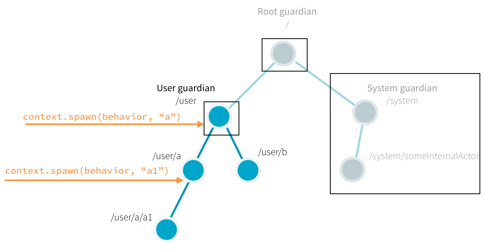

# Actor基础学习
## 依赖
在你的项目中添加以下依赖关系
```
    val AkkaVersion = "2.6.12"
    libraryDependencies += "com.typesafe.akka" %% "akka-actor-typed" % AkkaVersion
```

## 简介
使用Akka可以使您从创建actor系统的基础架构和编写控制基本行为所需的低级代码中解脱出来。
为了理解这一点，让我们看看你在代码中创建的actors和Akka在内部为你创建和管理的actors之间
的关系、actors生命周期和失败处理。

## Akka Actor的层级关系
在Akka中，一个Actor一定会有一个父Actor。你可以调用ActorContext.spawn()方法来创建一个
Actor。当你使用了Actor_A创建了一个Actor_B，那么Actor_A就是Actor_B的父亲。你可能疑惑，追根溯源，
整个系统中，你第一个创建的Actor，它的父亲是谁？

如下图所示，所有的actor都有一个共同的父代，即用户监护人，它在您启动ActorSystem时被定义和创建。
正如我们在快速入门指南中介绍的那样，创建一个actor会返回一个有效的URL引用。
因此，例如，如果使用context.spawn(someBehavior, "someActor")创建一个名为someActor的角色，
那么它的引用将路径为/user/someActor，为什么引用路径是/user/someActor而非/someActor呢？(毕竟是第一个被创建的Actor，难道不是作为根Actor吗？接下来的内容会做详细介绍)。



事实上，当你自己创建的第一个Actor启动运行的时候，Akka已经在Actor系统中创建了两个监护者Actor（有四个Actor-方框标出）。
名字后面包含guardian便是的是监护者的角色，监护人角色包含：

- ​    **/** &emsp;&emsp; root监控者，是系统中所有actors的父亲，也是在系统停止时，最后一个被停止的actor。
- ​    **/system** &emsp;&emsp; system监控者，是Akka(或者Akka构建的第三方库)创建的Actor，都在这个Actor下面。
- ​    **/user** &emsp;&emsp; user监控者，用于在用户应用程序中创建自己的Actor时候的最顶层的Actor，用户应用程序创建的Actors都是它的后代。

最简单有效的方法是通过打印ActorRef来观察系统中actor的层次结构。在下面的小实验中，我们创建一个acotr，然后打印这个actor的
引用(ActorRef)。然后创建这个Actor的子Actor并且打印引用。
